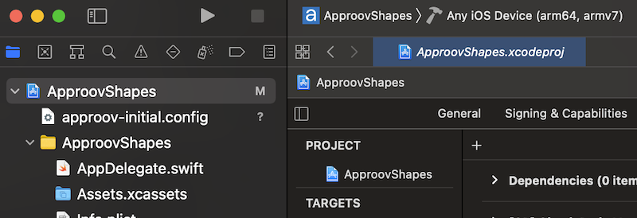

# Next Steps
Once you have finished a basic integration of the SDK and are able to see metrics from it, there are some further steps to provide full Approov integration.

These steps require access to the [Approov CLI](https://approov.io/docs/latest/approov-cli-tool-reference/), please follow the [Installation](https://approov.io/docs/latest/approov-installation/) instructions.

## ADDING API DOMAINS
In order for Approov tokens to be added by the interceptor for particular API domains is necessary to inform Approov about them. Execute the following command:

```
approov api -add <your-domain>
```
Approov tokens will then be added automatically to any requests to that domain (using the `Approov-Token` header, by default).

Note that this will also add a public key certicate pin for connections to the domain to ensure that no Man-in-the-Middle attacks on your app's communication are possible. Please read [Managing Pins](https://approov.io/docs/latest/approov-usage-documentation/#public-key-pinning-configuration) to understand this in more detail.

## REGISTERING APPS
In order for Approov to recognize the app as being valid it needs to be registered with the service. This requires building an `.ipa` file either using the `Archive` option of Xcode (this option will not be available if using the simulator) or building the app and then creating a compressed zip file and renaming it. Use the second option for which we have to make sure a `Generic iOS Device` is selected as build destination. This ensures an `embedded.mobileprovision` is included in the application package which is a requirement for the `approov` command line tool. 



You can now build the application by selecting `Product` and then `Archive`. Select the apropriate code signing options and eventually a destination to save the `.ipa` file (e.g. `app.ipa`).

```
approov registration -add app.ipa
```

> **IMPORTANT:** The registration takes up to 30 seconds to propagate across the Approov Cloud Infrastructure, therefore don't try to run the app again before this time as elapsed. During development of your app you can ensure it [always passes](https://approov.io/docs/latest/approov-usage-documentation/#adding-a-device-security-policy) so you do not have to register the IPA each time you modify it.

[Managing Registrations](https://approov.io/docs/latest/approov-usage-documentation/#managing-registrations) provides more details for app registrations.

# BITCODE SUPPORT
The Approov SDK is also available with bitcode support. If you wish to use it then you should modify the branch for the Approov service layer dependency to `<SDK Version>-bitcode` i.e. `2.7.0-bitcode`. Please then also use the `-bitcode` option when registering your application with the Approov service.

## BACKEND INTEGRATION
In order to fully implement Approov you must verify the Approov token in your backend API. Various [Backend API Quickstarts](https://approov.io/docs/latest/approov-integration-examples/backend-api/) are availble to suit your particular situation.

## OTHER FEATURES
There are various other Approov capabilities that you may wish to explore:

* Update your [Security Policy](https://approov.io/docs/latest/approov-usage-documentation/#security-policies) that determines the conditions under which an app will be given a valid Approov token.
* Learn how to [Manage Devices](https://approov.io/docs/latest/approov-usage-documentation/#managing-devices) that allows you to change the policies on specific devices.
* Understand how to provide access for other [Users](https://approov.io/docs/latest/approov-usage-documentation/#user-management) of your Approov account.
* Learn about [Automated Approov CLI Usage](https://approov.io/docs/latest/approov-usage-documentation/#automated-approov-cli-usage).
* Investigate other advanced features, such as [Offline Security Mode](https://approov.io/docs/latest/approov-usage-documentation/#offline-security-mode), [DeviceCheck Integration](https://approov.io/docs/latest/approov-usage-documentation/#apple-devicecheck-integration) and [AppAttest Integration](https://approov.io/docs/latest/approov-usage-documentation/#apple-appattest-integration).

## FURTHER OPTIONS

### Changing Approov Token Header Name
The default header name of `Approov-Token` can be changed by setting the variable `ApproovSession.approovTokenHeaderAndPrefix` like so:

```swift
ApproovSession.approovTokenHeaderAndPrefix = (approovTokenHeader: "Authorization", approovTokenPrefix: "Bearer ")
```

This will result in the Approov JWT token being appended to the `Bearer ` value of the `Authorization` header allowing your back end solution to reuse any code relying in `Authorization` header.
Please note that the default values for `approovTokenHeader` is `Approov-Token` and the `approovTokenPrefix` is set to an empty string.

### Token Binding
If want to use [Token Binding](https://approov.io/docs/latest/approov-usage-documentation/#token-binding) then set the header holding the value to be used for binding using the property `ApproovSession.bindHeader`. This takes the name of the header holding the value to be bound. This only needs to be called once but the header needs to be present on all API requests using Approov. It is also crucial to set the `ApproovSession.bindHeader` property before any token fetch occurs, like token prefetching being enabled in the `ApproovSession` constructor, since setting the value to be bound invalidates any (pre)fetched token.

### Token Prefetching
If you wish to reduce the latency associated with fetching the first Approov token, then constructing an `ApproovSession` object should be done setting `prefetchToken` parameter as `true`. This initiates the process of fetching an Approov token as a background task, so that a cached token is available immediately when subsequently needed, or at least the fetch time is reduced. Note that if this feature is being used with [Token Binding](https://approov.io/docs/latest/approov-usage-documentation/#token-binding) then the binding must be set prior to the prefetch, as changes to the binding invalidate any cached Approov token.

### Changing Configuration Persistence
An Approov app automatically downloads any new configurations of APIs and their pins that are available. These are stored in the [`UserDefaults`](https://developer.apple.com/documentation/foundation/userdefaults) for the app in a preference key `approov-dynamic`. You can store the preferences differently by modifying or overriding the methods `storeDynamicConfig` and `readDynamicApproovConfig` in `ApproovInterceptor.swift`.

### Network Retry Options
The `ApproovInterceptor` class implements Alamofire's Interceptor protocol which includes an option to invoke a retry attempt in case the original request failed. We do not implement the retry option in `ApproovInterceptor`, but if you require implementing one, you should mimic the contents of the `adapt()` function and perhaps add some logic regarding retry attempts. See an example [here](https://github.com/Alamofire/Alamofire/blob/master/Documentation/AdvancedUsage.md#adapting-and-retrying-requests-with-requestinterceptor).

### ApproovTrustManager
The `ApproovSession` object handles internally the creation of a default `AproovTrustManager`, if one is not provided during initialization. The `AproovTrustManager` then sets the mapping between hosts and evaluators internally. If you wish to use different evaluators for hosts not protected by Approov, you can initialize the `ApproovTrustManager` like so:

```swift
let evaluators: [String: ServerTrustEvaluating] = [
    "some.other.host.com": RevocationTrustEvaluator(),
    "another.host": PinnedCertificatesTrustEvaluator()
]

let manager = ApproovTrustManager(evaluators: evaluators)
session = ApproovSession(serverTrustManager: manager)
```

Please note that you do not have to specify the hosts that need to be protected by Approov, they are automatically set for you once a configuration has been fetched from the Approov servers. You can manage (adding and removing) Approov protected domains using the approov [admin tools](https://approov.io/docs/latest/approov-cli-tool-reference/).
By default, the `ApproovTrustManager` verifies all the hosts protected by Approov and any optional hosts provided a mapping to an evaluator has been provided as in the above code snippet. This means that any request to an additional host not known to the Approov SDK nor the `ApproovTrustManager`, lets say `https://approov.io`, will not be evaluated by Alamofire and it will not be protected by Approov. As long as the certificate presented by that host is valid, the connection will most likely go through. If you wish to change this behaviour, you may modify how the `ApproovTrustManager` is initialized in the above code:

```swift
let evaluators: [String: ServerTrustEvaluating] = [
    "some.other.host.com": RevocationTrustEvaluator(),
    "another.host": PinnedCertificatesTrustEvaluator()
]

let manager = ApproovTrustManager(allHostsMustBeEvaluated: true, evaluators: evaluators)
session = ApproovSession(serverTrustManager: manager)
```

The `allHostsMustBeEvaluated: true` parameter will evaluate `some.other.host.com` and `another.host` according to the evaluators specified above. The Approov SDK will verify the public key pinning of all the hosts specified using the [admin tools](https://approov.io/docs/latest/approov-cli-tool-reference/) but any connections to additional hosts will be rejected.

### Redirection
If any of the hosts you are protecting with Approov redirects requests to a different host, depending on the `allHostsMustBeEvaluated` option used and described above, you might need to protect both hosts with Approov and/or an evaluator as in the code example above, otherwise the original request might get evaluated and after a redirect is triggered, the target host connection is rejected.

### Alamofire Request
If your code makes use of the default Alamofire Session, like so:

```swift
AF.request("https://httpbin.org/get").response { response in
    debugPrint(response)
}
```

all you will need to do to use Approov is to replace the default Session object with the ApproovSession:

```swift
let approovSession = ApproovSession()
approovSession!.request("https://httpbin.org/get").responseData{ response in
        debugPrint(response)
}
```

### Network Delegate
Unfortunately we do not support network delegates in Alamofire. If you wish to use a network delegate and do not mind using apple's URLSession interface, we can offer an `ApproovURLSession` integration that does support network delegates.
