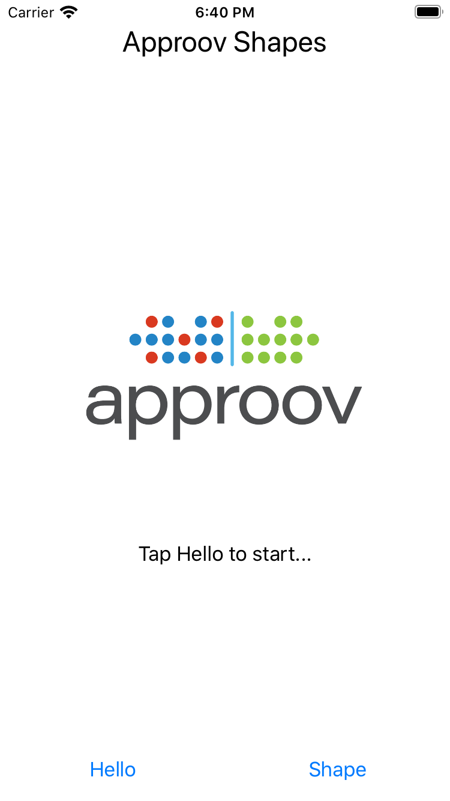
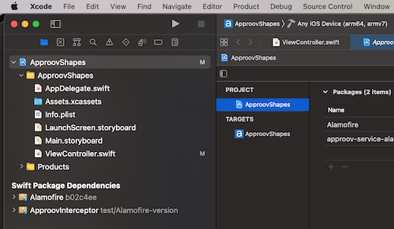

# Approov Quickstart: iOS Swift Alamofire

This quickstart is written specifically for native iOS apps that are written in Swift and using Alamofire for making the API calls that you wish to protect with Approov. If this is not your situation then check if there is a more relevant quickstart guide available.

This quickstart provides a step-by-step example of integrating Approov into an app using a simple `Shapes` example that shows a geometric shape based on a request to an API backend that can be protected with Approov.

It is also possible to use Approov in `Discovery` mode to perform an initial assessment of your app user base and whether there are requests being made to your backend API that are not coming from your mobile apps. This mode allows a simpler initial integration. If you wish to implement this first then follow the steps [here](https://github.com/approov/approov-service-okhttp) up to and including the `Discovery Mode` section

## WHAT YOU WILL NEED
* Access to a trial or paid Approov account
* The `approov` command line tool [installed](https://approov.io/docs/latest/approov-installation/) with access to your account
* [Xcode](https://developer.apple.com/xcode/) version 12 installed (version 12.3 is used in this guide)
* The contents of the folder containing this README
* An Apple mobile device with iOS 10 or higher

## WHAT YOU WILL LEARN
* How to integrate Approov into a real app in a step by step fashion
* How to register your app to get valid tokens from Approov
* A solid understanding of how to integrate Approov into your own Swift app that uses Alamofire
* Some pointers to other Approov features

## ALAMOFIRE FRAMEWORK

We include [Alamofire](https://github.com/Alamofire/Alamofire) as a `swift package manager` dependency in our project

## RUNNING THE SHAPES APP WITHOUT APPROOV

Open the `ApproovShapes.xcworkspace` project in the `shapes-app` folder using `File->Open` in Xcode. Ensure the `ApproovShapes` project is selected at the top of Xcode's project explorer panel.

Select your codesigning certificate in the `Signing & Capabilities` tab and run the application on your prefered device. Note that if you have difficulties codesigning the application, change the `Bundle Identifier` in the General tab to contain a unique prefix.


Once the application is running you will see two buttons:

<p>
    
</p>

Click on the `Hello` button and you should see this:

<p>
    
</p>

This checks the connectivity by connecting to the endpoint `https://shapes.approov.io/v1/hello`. Now press the `Shape` button and you will see this:

<p>
    
</p>

This contacts `https://shapes.approov.io/v2/shapes` to get the name of a random shape. It gets the status code 400 (`Bad Request`) because this endpoint is protected with an Approov token. Next, you will add Approov into the app so that it can generate valid Approov tokens and get shapes.

## ADD THE APPROOV SDK AND THE APPROOV SERVICE ALAMOFIRE

Get the latest Approov SDK by using `swift package manager`. The repository located at `https://github.com/approov/approov-service-alamofire.git` includes as a dependency the closed source Approov SDK alonside the `Alamofire SDK` and includes branches pointing to the relevant Approov SDK release versions as well as bitcode versions. The approov-service-alamofire is actually an open source wrapper layer that allows you to easily use Approov with Alamofire. Install the dependency by selecting the `ApproovShapes` project in Xcode and then selecting `File`, `Swift Packages`, `Add Package Dependency`:


You will then have to select the relevan Approov SDK version you wish to use. To do so, select the `branch` option and enter the relevant SDK version, in this case `2.7.0`:


Once you click `Next` the last screen will confirm the package product and target selection:


The Approov SDK is now included as a dependency in your project. 

This guide assumes you are NOT using bitcode. The Approov SDK is also available with bitcode support. If you wish to use it read the relevant section in the approov service [documentation](https://github.com/approov/approov-service-alamofire) since you will need to change the branch from which to obtain the code, in this case you should use branch `2.7.0-bitcode` , to use the bitcode enabled version of the SDK. Remember to also use `-bitcode` when using the `approov` admin tools to register your application with the Approov service.

## ENSURE THE SHAPES API IS ADDED

In order for Approov tokens to be generated for `https://shapes.approov.io/v2/shapes` it is necessary to inform Approov about it. If you are using a demo account this is unnecessary as it is already set up. For a trial account do:
```
$ approov api -add shapes.approov.io
```
Tokens for this domain will be automatically signed with the specific secret for this domain, rather than the normal one for your account.

## SETUP YOUR APPROOV CONFIGURATION

The Approov SDK needs a configuration string to identify the account associated with the app. Obtain it using:
```
$ approov sdk -getConfigString
```

This will output a configuration string, something like `#123456#K/XPlLtfcwnWkzv99Wj5VmAxo4CrU267J1KlQyoz8Qo=`, that will identify your Approov account. Use this configuration string as an additional parameter when initializing the `ApproovSession`, like so:

```swift
let session = ApproovSession(configString: "#123456#K/XPlLtfcwnWkzv99Wj5VmAxo4CrU267J1KlQyoz8Qo=")
```

## MODIFY THE APP TO USE APPROOV

Before using Approov you need to import the Alamofire Service. In the `ViewController.swift` source file import the service module:

```swift
import ApproovInterceptor
```

Find the function definition for `initializeSession()` in the `ViewController.swift` source file:
```swift
// Create the session only if it does not exist yet
func initializeSession(){
    if (session == nil) {
        session = Session()
    }
}
```
Replace the above code with the one using Approov and remember to use the actual configuration string for your account:
```swift
func initializeSession(){
    if (session == nil) {
        session = ApproovSession(configString: "#123456#K/XPlLtfcwnWkzv99Wj5VmAxo4CrU267J1KlQyoz8Qo=")
    }
}
```

The `ApproovSession` class adds the `Approov-Token` header and also applies pinning for the connections to ensure that no Man-in-the-Middle can eavesdrop on any communication being made. The `prefetchToken` option allows the ApproovSDK to asynchronously begin token fetching and allows potentially an attestation token to be available immediately when needed, thus speeding up the costly initial network connection.

## REGISTER YOUR APP WITH APPROOV

In order for Approov to recognize the app as being valid it needs to be registered with the service. This requires building an `.ipa` file using the `Archive` option of Xcode (this option will not be avaialable if using the simulator). Make sure `Any iOS Device` is selected as build destination. This ensures an `embedded.mobileprovision` is included in the application package which is a requirement for the `approov` command line tool. 



We can now build the application by selecting `Product` and then `Archive`. Select the apropriate code signing options and eventually a destination to save the `.ipa` file.

Copy the ApproovShapes.ipa file to a convenient working directory. Register the app with Approov:

```
$ approov registration -add ApproovShapes.ipa
registering app ApproovShapes
lhB30o4UMuzjDsdNicQ6QiM6cEcC4Y5k/SF72fID/Es=com.yourcompany-name.ApproovShapes-1.0[1]-6811  SDK:iOS-universal(2.7.0)
registration successful
```

## RUNNING THE SHAPES APP WITH APPROOV

Install the `ApproovShapes.ipa` that you just registered on the device. You will need to remove the old app from the device first. Please note that you need to run the application with Approov SDK on a real device and not a simulator. If you are using an emulator, you will need to learn how [whitelisting](https://approov.io/docs/latest/approov-usage-documentation/#adding-a-device-security-policy) works since the simulators are not real devices and you will not be able to succesfully authenticate the app.
If using Mac OS Catalina, simply drag the `ipa` file to the device. Alternatively you can select `Window`, then `Devices and Simulators` and after selecting your device click on the small `+` sign to locate the `ipa` archive you would like to install.


Launch the app and press the `Shape` button. You should now see this (or another shape):

<p>
    
</p>

This means that the app is getting a validly signed Approov token to present to the shapes endpoint.

## WHAT IF I DON'T GET SHAPES

If you still don't get a valid shape then there are some things you can try. Remember this may be because the device you are using has some characteristics that cause rejection for the currently set [Security Policy](https://approov.io/docs/latest/approov-usage-documentation/#security-policies) on your account:

* Ensure that the version of the app you are running is exactly the one you registered with Approov.
* If you run the app from a debugger then valid tokens are not issued unless you have [whitelisted](https://approov.io/docs/latest/approov-usage-documentation/#adding-a-device-security-policy) the device.
* Look at the [`syslog`](https://developer.apple.com/documentation/os/logging) output from the device. Information about any Approov token fetched or an error is printed, e.g. `Approov: Approov token for host: https://approov.io : {"anno":["debug","allow-debug"],"did":"/Ja+kMUIrmd0wc+qECR0rQ==","exp":1589484841,"ip":"2a01:4b00:f42d:2200:e16f:f767:bc0a:a73c","sip":"YM8iTv"}`. You can easily [check](https://approov.io/docs/latest/approov-usage-documentation/#loggable-tokens) the validity.

If you have a trial (as opposed to demo) account you have some additional options:
* Consider using an [Annotation Policy](https://approov.io/docs/latest/approov-usage-documentation/#annotation-policies) during development to directly see why the device is not being issued with a valid token.
* Use `approov metrics` to see [Live Metrics](https://approov.io/docs/latest/approov-usage-documentation/#live-metrics) of the cause of failure.
* You can use a debugger or emulator and get valid Approov tokens on a specific device by [whitelisting](https://approov.io/docs/latest/approov-usage-documentation/#adding-a-device-security-policy). As a shortcut, when you are first setting up, you can add a [device security policy](https://approov.io/docs/latest/approov-usage-documentation/#adding-a-device-security-policy) using the `latest` shortcut as discussed so that the `device ID` doesn't need to be extracted from the logs or an Approov token.

## CHANGING YOUR OWN APP TO USE APPROOV

### Configuration

This quick start guide has taken you through the steps of adding Approov to the shapes demonstration app. If you have an app using Swift you can follow exactly the same steps to add Approov. Take a note of the dependency discussion [here](https://approov.io/docs/latest/approov-usage-documentation/#importing-the-approov-sdk-into-ios-xcode).

### API Domains
Remember you need to [add](https://approov.io/docs/latest/approov-usage-documentation/#adding-api-domains) all of the API domains that you wish to send Approov tokens for. You can still use the Approov `swift` client for other domains, but no `Approov-Token` will be sent. 


### Changing Your API Backend
The Shapes example app uses the API endpoint `https://shapes.approov.io/v2/shapes` hosted on Approov's servers. If you want to integrate Approov into your own app you will need to [integrate](https://approov.io/docs/latest/approov-usage-documentation/#backend-integration) an Approov token check. Since the Approov token is simply a standard [JWT](https://en.wikipedia.org/wiki/JSON_Web_Token) this is usually straightforward. [Backend integration](https://approov.io/docs/latest/approov-integration-examples/backend-api/) examples provide a detailed walk-through for particular languages. Note that the default header name of `Approov-Token` can be modified by changing the variable `approovTokenPrefix`, i.e. in integrations that need to be prefixed with `Bearer`, like the `Authorization` header. It is also possible to change the `Approov-Token` header completely by overriding the contents of `kApproovTokenHeader` variable.


## NEXT STEPS

This quick start guide has shown you how to integrate Approov with your existing app. Now you might want to explore some other Approov features:

* Managing your app [registrations](https://approov.io/docs/latest/approov-usage-documentation/#managing-registrations)
* Manage the [pins](https://approov.io/docs/latest/approov-usage-documentation/#public-key-pinning-configuration) on the API domains to ensure that no Man-in-the-Middle attacks on your app's communication are possible.
* Update your [Security Policy](https://approov.io/docs/latest/approov-usage-documentation/#security-policies) that determines the conditions under which an app will be given a valid Approov token.
* Learn how to [Manage Devices](https://approov.io/docs/latest/approov-usage-documentation/#managing-devices) that allows you to change the policies on specific devices.
* Understand how to provide access for other [Users](https://approov.io/docs/latest/approov-usage-documentation/#user-management) of your Approov account.
* Use the [Metrics Graphs](https://approov.io/docs/latest/approov-usage-documentation/#metrics-graphs) to see live and accumulated metrics of devices using your account and any reasons for devices being rejected and not being provided with valid Approov tokens. You can also see your billing usage which is based on the total number of unique devices using your account each month.
* Use [Service Monitoring](https://approov.io/docs/latest/approov-usage-documentation/#service-monitoring) emails to receive monthly (or, optionally, daily) summaries of your Approov usage.
* Consider using [Token Binding](https://approov.io/docs/latest/approov-usage-documentation/#token-binding).
* Learn about [automated approov CLI usage](https://approov.io/docs/latest/approov-usage-documentation/#automated-approov-cli-usage).
* Investigate other advanced features, such as [Offline Security Mode](https://approov.io/docs/latest/approov-usage-documentation/#offline-security-mode) and [DeviceCheck Integration](https://approov.io/docs/latest/approov-usage-documentation/#apple-devicecheck-integration).
